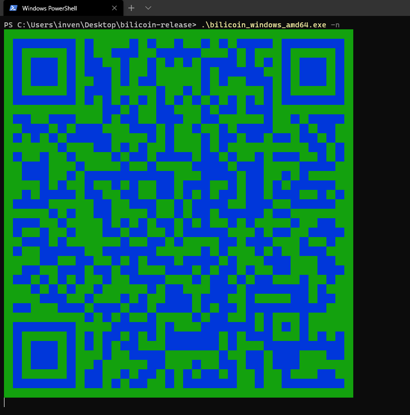

# bilicoin 自动投币

## 说明
1. 在B站，每日会自动投入补全 50 经验，帮助你快速升级。   
2. 主要筛选热门鬼畜区的视频进行投币。  
3. 不会影响你手动投币  
   由于程序会自动检查当天有没有拿到 50 经验，并在只会在每天的最后时刻补全，也就是说如果当天已经手动投入超过5个币，程序就不会帮你投了。  
4. 支持[方糖](http://sc.ftqq.com/ "ftqq")，进行微信通知。  

## 使用  
项目请自行编译或者从 `Releases` 中下载

完整的项目包括以下三个文件: `bilicoin_os_arch`, `bili.js`, `bili.json`

1. 命令行输入下面内容，会弹出 `QRCode` 使用B站客户端扫码，添加用户  
    ```
    ./bilicoin_linux_amd64 -n
    ```
    

2. 登录成功后使用命令行输入下面内容即可开启投币服务  
    ```
    ./bilicoin_linux_amd64 -s
    ```

## 其他命令  

1. 查询当前配置文件中所有的 `UID`:  
      
    ```
    ./bilicoin_linux_amd64 -l
    ```
2. 从配置文件中删除指定的 `UID`:  
    
    ```
    ./bilicoin_linux_amd64 30722 -d
    ```

## 其他  
1. `bili.json` 中的 `canvas_finger` 的值可以选择修改一下，不过不影响使用。

## 注意问题 
