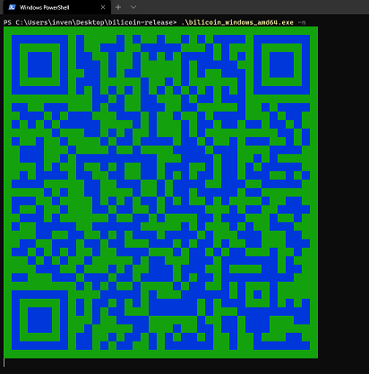

<div> 
   <h1 align="center">
      bilicoin 自动投币工具
      <i class="level l6"></i>
   </h1>
</div>

<style>
.level {
   background: url(data:image/png;base64,iVBORw0KGgoAAAANSUhEUgAAA+gAAAPoCAMAAAB6fSTWAAAA51BMVEUAAACYoKhwd3yboqni5emDjJL7+/yZoqoAodbnix8AodYAodaZoqoAodYAodaln5jnix8Aodbnix8AodaZoqoAodbnix8Aodbnix/yXY6ZoqoAodYAodYAodaZoqoAodaZoqryXY7yXY4AodbyXY6ZoqryXY6ZoqoAodaZoqoAodaZoqryXY7nix8AodYAodbnix+ZoqqZoqrnix8AodYAodbnix+Zoqr////19vfM0NcAoda/v7/l6e9MyP//u1PlL+z/s3yS0eWV3bL/bAAVFRX/AACEHPnnix+M2fn/1pbyXY4iIiIkv4BgAAAAOHRSTlMA9fUreZKu4eI+EfDtgtwP7AkexYcv2WfIsP3refnX0mcmGUPyxsScjXkXF++zoZpMMyn+Ppl8Q6/LsKoAAA3QSURBVHja7NvdbtowGIfxP7UsaEqbfkGj0bWVpqofiK0f2nZALyD3f0V7E4KsbULCjpRA9fykQDjw4SOb2BEAAAAAAAAAAAAAAAAAAAAAAAAAAAAAAAAAAAAAAAAAAAAAAG2cF4X64vzAeJc+/sDYeGDH3Q0e1MrV1x9q4eW0LNUTP2j4xPEHDS9gp70O50O1MRk9j5Tu13tZhX4+LdS5ejJvpnUlqCfzZloXsMPym99qFfrZ7Telh54vyop1Xk7VNevbqeas+KT5fD2eOR3b+FhR1/L84dJaz42SZNnPR2UnWZadKV7+Mi1rss7P1THXdB7u47iq83DP/3RsijtQpevQ78bjL/fS29CMHxTvana0vDjT5MTMviuSVb6movvO5Qe+Wr2vLvsRP6H7avW+ujxTOjaErrrw+mq+1K1hrqHWxoo3yjTS2kyRTssQeh9sEg+hO/uIZJN4CN3xLx07G7pC6G/3KaErhD65UKQyUGEfhbplaYfQlRK6Quja29CPj4W/febQn55ahn59vY+hO9VcWuhh/P6GfrxcUvq/PnHo965l6BcTRZruwNLdexnv05buYfzeLt2tc0qPkBi6qb77D31+o3ahP58o1mERQl8U/TyMc3bZjUt9GOfsshvHwzhsDt00jdf3fYZ+d9ky9KtHxcsPe99ec746NJO+veZ8dWiG7TVs9PGfzkOfr0PPb16TQn9eh57dTtoemCm0NQ7MAHH76OOVJylxH/2oNrtufQR2oa1xBBbYN/ZSy7ui8VILsF94TRUAAAAAAAAAAAAAAAAAAAAAAAAAAAAAAAAAAAAAAADAH3buoMVNIAzA8BxESA5ldyHkUui1p/Y6YrJ71v//g/rFmFoKaaMBdZPngTWzh+/4MqKTAAAAAAAAAAAAAAAAAAAAAAAAAAAAAAAAwIMqyirnqizungfWqihzryzum5c6rFVkWrUfoa0i1Unzx+Y9NMfTPKzZvv6ZnlJ02n702ih1wnzz3muUzrrt6rpOS3kbFrMrzp0PpRdj57vOh9LdvbNer/WCob+9bFJn8zJ/6eWl87Y9l16OnW/6xpvuakvnvw5naW7bbX2y3W5f0xI2UXr/MbciV33nffBVLsbNH/vO++CPtnSuxT3o/k/z2td/+JGWEIkv0vmwobf596KcsqE3ORa2dK46nNLuLsNiXpF3/F2kRUTkC3QeqnzpPBadXI2bv3Qei07Mg9CvlR6dLyDnc+ehqqou9Dxu/tJ5zB+70HOCtYf+Nd3sgUKvcqedGno/3widTxL6Lt3skW7do+/ofPKtezh17tadf4YeTp8rCP1Lup2HcR7GMSL00BfeNb5o6N/TzR7r9Vobnd/zeq2Jzr1e47rD35YM/dsujfMwB2bauE4/MNMdl7Ghs2r7+o5HcY7AOgILn4AvtcAz8DVVeAZ+eAKegp+SAgAAAAAAAAAAAAAAAAAAAH6xczctbQRxAIf/RmHDGgyiQWisCkV8gxaF0nZDTjkF+v0/T4dNrIFe6g5JnOR5srksDHP6wTCzDAAAAAAAAAAAAAAAAAAAAAAAAAAAAAAAAAAAlKhZdXRY3HjgPzS/Vkybd5fW/FyRxmfOr3RorS/0ZHqUEXqSxufODyRrDD1pckJPmuz5gQihQxc3g8GnwcJDdHAxPp4ct8aXUR6hsx+qp6iiNbx6jvfrP0Y/WvX1KIojdDZtthCbVbVP6+a8S+jt07q4j+IsQjvIDH2eGfpU6Dtutioi2WLoT1d5oT+eRHEWof0+yAt9Ms8LvZkKfbfNoi28/be2GXrcHmaFHmflrd2XoafSs0KfzPNCb6ZC32kfK/SHh7zQL8vbjluGnkrPC30yzwu9mQp9l62Evv2le7zc5oU+OovS/A29J3Q66BT6Vjbjhm+hx6BD6PVb6DGO0ryG3rN0Z41e406/jNBzz9FvI16qZHDX7Rz97DRGJ8n4a5RmGXrPZhzr1Gb92vjyzaYNh3fnMbwaJtFFXX+/j/qkruvTKM4itJ7jNdZq9q/YuFT5j6iiu9PrL9GPIvlghj3yXD1VkWHUfxS60Pnwbg7uIsfF529RJKHDHhA67AEXT8AecJUU7IHG5ZAAAAAAAAAAAAAAAMAfdu6etUEgDuDwNcnkUMgQshS6dmrXeOKSLdDv/3kqlxeELCVXk9T/84Aogtz0w+OUAwAAAAAAAAAAAAAAAAAAAAAAAAAAAAAAAAAAAACAmVqu8ti/ex74RWe5b8dueH43Vj0+8PdWfVsV2mrofOyG8YUOU8ttXWh5Vxd6boUOV4QOt9h2F28pHqETwxD4cBTvmxSO0Lm3/VGqUBd695HCuYT2Uhn6oTL0Xuhzth8rdx4Z+msKJ587/64L/dDVhd5noc/ZPpXCy1E8LPQi3tw9nzuvC/3Q1YXeZ6HP2pOFHm85Lp86rwv90NWF3mehz9so9CeYug+X0Rz7WgidKzN+o0cN3dSdaZ36LufHhL7tRj5TNLk9WliMY0Il69J3xap7paYpkTdNs07h5PZk4fMa09lfS/e3Djlr98MM0WyELnQC2HZfKSShQwBChwBsPAEB2EoKIljaHBIAAAAAAAAAAPhhzw5WGwSiMIzekCGbkF1Wgb5HhzIL3/+lClaCEixCCMl4zwER3H/8OgIAAAAAAAAAAAAAAAAAAAAAAAAAAAAAADtX2gYlgJ617w1aAD0TOiQgdEhA6JCA0CEBoUMCQocEhA4JCB0SEDokIHRIQOiQgNBJ6nq4xlMu50t0Q+gkdbsd4ilfP+fohtB5o+FPbGTRhU4vhrkYr+CB0OnbEPfChb5O6PTtU0L36i505l4Z+vRkI4dxQqcXi9AHi75C6PRt6nu6+0ZfIXT6NmY99i30/widrg0z/qOvEjo4jBM6WHShQ0ZChwSEDgkIHRIQOiQgdEhA6JDAQ+i1tSp02Je2rLy2cjyWVqvQYUfaYsxPJUbl1KrQYTfaYszjbpx1of+yZ8c4DINAFAW3QJwpFO64/5kiMAUU6eP1jGS5oH76loEcajvGfDlnvdUAnqxc7dOuY8yPWZ/HJYBHK3WN+e9jnQMAAAAAAAAAAAAAAAAAAAAAAAAAAAAAAAAAAAAAAAAAAAAAAAAAAPyNfgsgmb6LQeiQTo9Z+P2ERYeUhA4vsIXu0x2y2kOfhA75rL7HW+iQ1cx69O2vO+TVN+7RAQAAAAAAAAAAvuzZwQnAIBBE0a1u+i8pqBch15wm74FawWdFAQAAAAAAAAAAAAAAAAAAAAAAAAAAAAAAAAAAAAAAAAAAAAAAAAAAAAAAAAAAvpFjgDK5zSJ0qJPZhZ81JjpUEjr8wBW6qzu0ek10oUOfTJZ1Ch1aZW/JeHWHXrn4RwcAAAAAAHjYs2MbgIEQCIKURv9VWY8dfAGOjhkJUcFGBwAAAAAAAAAAAAAAAAAAAAAAAAAAAAAAAAAAAAAAAAAAAAAAAAAAAAAAAAAAAAAA8I9+FRCmb3UIHeJ0TeFzQ+iQR+iwgNBhAaHDAl/f5wsdUk3W07fQIVZf7OgAAAAPe3ZQA0AIQ1Gw7r5/Rxu6lwrgVGYSqIIXCAAAAAAAAAAAAAAAAAAAAAAAAAAAAAAAAAAAAAAAAAAAAAAAAAAAAAAAAAAAAAAAAAAAANyRXwHLZKpD6LBOqgvv1UPosI/Q4QEjdFd32MqJDg9I5ThT6LBVekvKqzvslcE/+sduHZ0AAIIAFHQ5918pMggH6MvuQJzgoQAAAAAAAAAAAAAAAAAAAAAAAAAAAAAAAAAAAAAAAAAAAAAAAAAAAAAAAAAAAAAAAAAAAAAAAG/kEcAw2cUmdBgnowqvqSV0mEfo8IEWutcdprqh17joiz07tgEQhgEgmBoEUuQaZZDU3n8lCBUbIFl3hT3BNzaUlC2XtYUOVeU7MpurO9SVH/7oAAAAAAAAAAAAAAAAAAAAAAAAAAAAAAAAAAAAAAAAAAAAAAAAAAAAAAAAAAAAAAAAAAAAAL+L+YgGVBZzaUBp2xA6FNaP8zqPmEPoUFaPueyxCf1mz45NIIaBIAAqdCKBcOTAgZBDh86uhO+/n9fzTZhjJtgOloNbSKtGm322qGX3jIOsWjwrn2gFSOuMvrLHWYC0WkwXHbKrsc0+t6gFSKvv8bP3AuT139H1HAAAAAAAAAAAAAAAAAAAAAAAAAAAAAAAAAAAAAAAAAAAAAAAAAAAAAAAAAAAAAAAAAAA4OXGcV3HKEBi4/4st6Z/2bODG4BhEAaArJFnoyjLeP99WnUMuHuwgQXC0NnK2vsbBfR1sqt2TgF9CToM4HSHATzjYIJnJeo16O3mdwvoS9BhhqSA7q51DgAAAAAAAAAAAAAAAAAAAAAAAAAAAAAAAAAAAAAAAAAAAAAAAAAAAAAAAAAAAAAAAAAve3AgAAAAAADk/9oIqqqqqqqqqqqqqqqqqqqqqqqqqqqqqqqqqqqqqqqqqqqqqqqqqqqqqqqqqqqqqqqqqqqqqqqqqqqqqqrCHhwIAAAAAAD5vzaCqqqqqqqqqqqqqqqqqqqqqqqqqqqqqqqqqqqqqqqqqqqqqqqqqqqqqqqqqqqqqqqqqqqqqqqqqqqqqqqwBwcCAAAAAED+r42gqqqqqqqqqqqqqqqqqqqqqqqqqqqqqqqqqqqqqqqqqqqqqqqqqqqqqqqqqqqqqqqqqqqqqqqqqqqqqirtwQEJAAAAgKD/r9sRqAAAAAAAAAAAAAAAAAAAAAAAAAAAAAAA8BfEgGFMI1IvvAAAAABJRU5ErkJggg==) no-repeat
}
</style>

## 说明  

1. 在B站，每日会自动投入补全 50 经验，帮助你快速升级  
2. 主要筛选热门鬼畜区的视频进行投币  
3. 不会影响你手动投币  
   由于程序会自动检查当天有没有拿到 50 经验，并在只会在每天的最后时刻补全，也就是说如果当天已经手动投入超过5个币，程序就不会帮你投了  
4. 支持[方糖](http://sc.ftqq.com/ "ftqq")进行微信通知  
5. 支持 `QRCode` 登录，无需手动粘贴 `Cookie`  
6. 支持多用户批量处理  
7. 支持通过 `API` 进行控制  
8. [Demo 查看](http://r3in.top:9090/version "Demo")  
9. 有空就更新  

## 获取工具  

项目请自行编译或者从 Release 中下载  
完整的项目包括以下两个文件: `bilicoin_os_arch`, `bili.json[自动生成]`  
1. 编译  
    ```
    git clone https://github.com/r3inbowari/bilicoin.git
    cd bilicoin
    ./build.bat or ./build_upx.bat
    ```

2. 下载  
   从 [Release](https://github.com/r3inbowari/bilicoin/releases "Releases Download") 中下载  

## 基本使用  

1. 命令行输入下面内容，会弹出 `QRCode` 使用B站手机客户端扫码，添加用户  
    ```
    ./bilicoin_linux_amd64 -n
    ```
    

2. 登录成功后使用命令行输入下面内容即可开启投币服务(使用-s选项时请确保 `bili.json` 文件内至少一个用户)  
    ```
    ./bilicoin_linux_amd64 -s
    ```

## 通过 `API` 使用(需要自己开发界面)
1. 命令行输入下面内容，进入服务器模式  
   
    ```
    ./bilicoin_linux_amd64 -a
    ```
   
2. 基本请求  
   详细的请求和响应格式可以看[这里](https://docs.apipost.cn/view/8ab6ae6778a3b405 "API DOC")  
   
    ```
    获得所有用户
    GET /users
    eg: http://r3inbowari.top:9090/users
    
    添加用户请求
    POST /user
    Response oauthData
    二维码格式(这里随机生成的c44d66aa771148b6360ddf70876e6684即为oauthData参数)：
    https://passport.bilibili.com/qrcode/h5/login?oauthKey=c44d66aa771148b6360ddf70876e6684
    
    oAuth回调,是否登陆成功(带上oauthData)
    POST /user?oauth=c44d66aa771148b6360ddf70876e6684
    
    试图删除一个UID
    DETETE/user?uid=3077202
    
    试图修改UID的Cron表达式
    GET /{id}/cron?spec=cron表达式
    
    试图修改UID的FTQQ的key或者是开关
    GET /{id}/ft?key=方糖key&sw=开关
    ```

## 其他命令  

1. 查询当前配置文件中所有的 `UID`:  
      
    ```
    ./bilicoin_linux_amd64 -l
    ```
   
2. 从配置文件中删除指定的 `UID`:  
    
    ```
    ./bilicoin_linux_amd64 [UID] -d
    // example
    // 1. 尝试删除 UID 为 30772 的登录信息
    ./bilicoin_linux_amd64 30722 -d
    ```
   
3. 配置方糖微信通知[可选]  
   
    ```
    ./bilicoin_linux_amd64 -f [用户ID UID] [方糖 SecretKey]
    // example: 
    // 1. 添加方糖key
    ./bilicoin_linux_amd64 -f 933330 SCUxxxxxTe034cxxxxx732b1xxxxx23f7exxxxxd05eaxxxxxxxxxx

    // 2. 清除方糖key
    ./bilicoin_linux_amd64 -f 933330
    ```
 
 4. 修改Cron表达式(默认是30 50 23 * * ?)  
   
    ```
    ./bilicoin_linux_amd64 -c [用户ID UID] [Cron Spec]
    // example: 
    // 1. 修改cron
    ./bilicoin_linux_amd64 -c 933330 0 10 20 * * ?
    ```

## 使用 Docker 构建  

你也可以使用 `docker` 进行部署，通过使用api进行控制。  
1. 构建镜像 
   
    ```
    // build image
    docker build -t r3inbowari/bilicoin:v1.0.3 .

    // prune dangling image: builder
    docker image prune --filter label=stage=builder
    ```

2. 如果不想构建的话可以直接拉取已经构建好的镜像[linux/amd64](https://hub.docker.com/repository/docker/r3inbowari/bilicoin "DockerHub Page")  
   
    ```
    docker pull r3inbowari/bilicoin
    ```

3. 直接运行即可  
   
    ```
    // run
    docker run \
    --name bilicoin \
    -p 9090:9090 \
    -itd --restart=always \
    r3inbowari/bilicoin:v1.0.3
    ```
    
4. 浏览器打开地址验证是否开启  
   
   ```
   GET http://localhost:9090/version
   ```
   
## 其他问题  
1. `bili.json` 中的 `canvas_finger` 是 `canvas-base64` 生成的随机数值, 可以选择修改一下，不过不影响使用。  
2. 多用户投币重复使用二维码方式登录即可。  
3. 重复登录同一个账号时，该账号的上一次登录信息将会被覆盖。  
